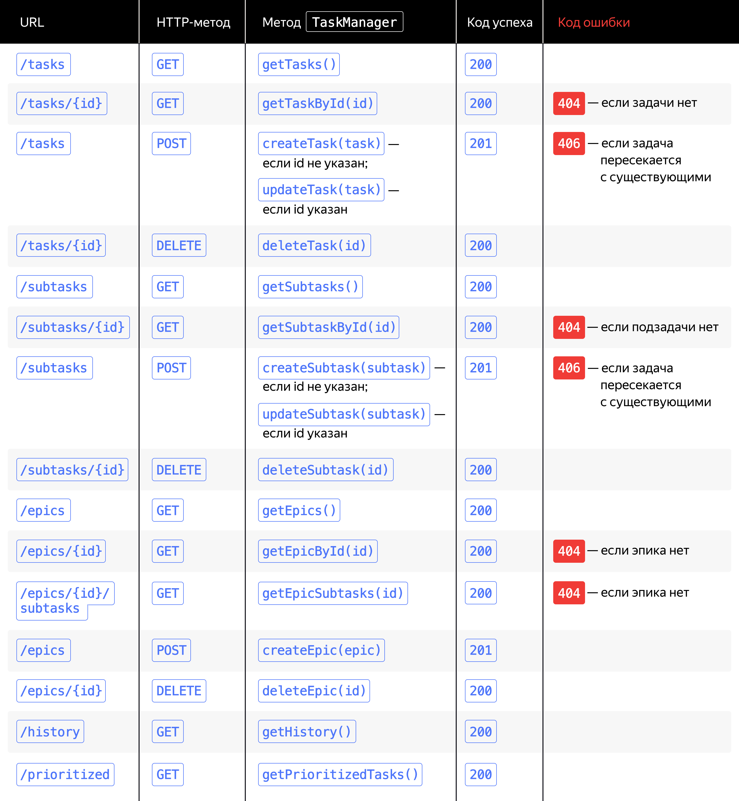

# Трекер задач Kanban - приложение для управления задачами
 java, rest-api, gson, junit

## О проекте

Монолитное приложение, использующее методологию управления
задачами Kanban с поддержкой трех видов задач: 
 - task 
 - subtask 
 - epic 
 
Каждый тип задачи имеет три возможных состояния: 
 - new 
 - in progress 
 - done

## Основные функции
- Хранение данных в оперативной памяти, загрузка и сохранение данных в CSV-файл
- Создание, получение, удаление, обновление, управление статусами всех типов задач
- Получение истории просмотров задач

## Эндпоинты
